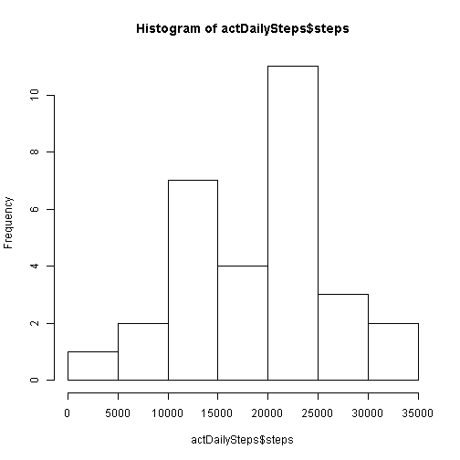

Coursera - Reproducible Research

###Peer Assessments /Peer Assessment 1


```r
#load the required library
library(plyr)

#Read the activity.csv data
actData <- read.csv("activity.csv")

#filter the na values and get a clean dataset
actDataClean <- actData[!is.na(actData$steps),]

#convert from factor to date data type
actDataClean$date <- as.Date(actDataClean$date, "%Y-%m-%d")

#extract the days to group the data
actDataClean$day <- strftime(actDataClean$date, "%d")
```

###What is mean total number of steps taken per day?

For this part of the assignment, you can ignore the missing values in the dataset.

1. Calculate the total number of steps taken per day


```r
#aggregate the cleaned data for sum of the steps for each day
actDailySteps <- aggregate(steps ~ day, data=actDataClean, FUN=sum )

#show the value of total steps for each day
actDailySteps
```

```
##    day steps
## 1   02 10726
## 2   03 21923
## 3   04 12116
## 4   05 23733
## 5   06 23754
## 6   07 23898
## 7   08  3219
## 8   09 12811
## 9   10  9900
## 10  11 22912
## 11  12 28147
## 12  13 19762
## 13  14 15098
## 14  15 10180
## 15  16 20525
## 16  17 27791
## 17  18 25166
## 18  19 20670
## 19  20 14867
## 20  21 21608
## 21  22 33887
## 22  23 30112
## 23  24 22833
## 24  25 14326
## 25  26 17940
## 26  27 23765
## 27  28 21641
## 28  29 12065
## 29  30  9819
## 30  31 15414
```

2. If you do not understand the difference between a histogram and a barplot, research the difference between them. Make a histogram of the total number of steps taken each day


```r
#plot the hostogram of total of steps for each day
hist(actDailySteps$steps)
```

 

3. Calculate and report the mean and median of the total number of steps taken per day


```r
#calculate the mean and median of steps for each day
ddply(actDataClean,~day,summarise,mean=mean(steps),median=median(steps))
```

```
##    day     mean median
## 1   02 18.62153      0
## 2   03 38.06076      0
## 3   04 42.06944      0
## 4   05 41.20312      0
## 5   06 41.23958      0
## 6   07 41.48958      0
## 7   08 11.17708      0
## 8   09 44.48264      0
## 9   10 34.37500      0
## 10  11 39.77778      0
## 11  12 48.86632      0
## 12  13 34.30903      0
## 13  14 52.42361      0
## 14  15 17.67361      0
## 15  16 35.63368      0
## 16  17 48.24826      0
## 17  18 43.69097      0
## 18  19 35.88542      0
## 19  20 25.81076      0
## 20  21 37.51389      0
## 21  22 58.83160      0
## 22  23 52.27778      0
## 23  24 39.64062      0
## 24  25 24.87153      0
## 25  26 31.14583      0
## 26  27 41.25868      0
## 27  28 37.57118      0
## 28  29 20.94618      0
## 29  30 34.09375      0
## 30  31 53.52083      0
```


###What is the average daily activity pattern?

1. Make a time series plot (i.e. type = "l") of the 5-minute interval (x-axis) and the average number of steps taken, averaged across all days (y-axis)


```r
#calculate the mean of steps grouped by interval
actDataInterval <- aggregate(steps ~ interval, data = actDataClean, FUN = mean )

#plot a time-series graph with interval on x axis and average steps on y axis
plot(actDataInterval$interval, actDataInterval$steps, type="l", xlab= "Interval", ylab= "Average steps", col="red" , lwd=2)
```

 

2. Which 5-minute interval, on average across all the days in the dataset, contains the maximum number of steps?


```r
actDataInterval[actDataInterval$steps == max(actDataInterval$steps),]
```

```
##     interval    steps
## 104      835 206.1698
```

Interval 825 has the maximum number of average steps accross all days.


###Imputing missing values

Note that there are a number of days/intervals where there are missing values (coded as NA). The presence of missing days may introduce bias into some calculations or summaries of the data.

1. Calculate and report the total number of missing values in the dataset (i.e. the total number of rows with NAs)


```r
#number of rows with NA values will be a difference of original data and clean data (dataset not having NA)
nrow(actData) - nrow(actDataClean)
```

```
## [1] 2304
```

2. Devise a strategy for filling in all of the missing values in the dataset. The strategy does not need to be sophisticated. For example, you could use the mean/median for that day, or the mean for that 5-minute interval, etc.

3. Create a new dataset that is equal to the original dataset but with the missing data filled in.


```r
#merge the original data and mean steps data for each interval
actDataNoNa <- merge(actData, actDataInterval, by= "interval")

#replace the NA values of steps for each interval with the average of steps for that interval
actDataNoNa[is.na(actDataNoNa$steps.x),]$steps.x <- round(actDataNoNa[is.na(actDataNoNa$steps.x), "steps.y"])
```

4. Make a histogram of the total number of steps taken each day and Calculate and report the mean and median total number of steps taken per day. Do these values differ from the estimates from the first part of the assignment? What is the impact of imputing missing data on the estimates of the total daily number of steps?


```r
#extract the days to group the data
actDataNoNa$day <- strftime(actDataNoNa$date, "%d")

#aggregate the cleaned data for sum of the steps for each day
actNoNaSteps <- aggregate(steps.x ~ day, data=actDataNoNa, FUN=sum )

hist(actNoNaSteps$steps.x)
```

 

```r
#calculate the mean and median of steps for each day
ddply(actDataNoNa,~day,summarise,mean.x=mean(steps.x),median.x=median(steps.x))
```

```
##    day   mean.x median.x
## 1   01 37.36806     34.5
## 2   02 18.62153      0.0
## 3   03 38.06076      0.0
## 4   04 39.71875      8.5
## 5   05 41.20312      0.0
## 6   06 41.23958      0.0
## 7   07 41.48958      0.0
## 8   08 24.27257      1.0
## 9   09 40.92535      7.5
## 10  10 35.87153      9.0
## 11  11 39.77778      0.0
## 12  12 48.86632      0.0
## 13  13 34.30903      0.0
## 14  14 44.89583      8.0
## 15  15 17.67361      0.0
## 16  16 35.63368      0.0
## 17  17 48.24826      0.0
## 18  18 43.69097      0.0
## 19  19 35.88542      0.0
## 20  20 25.81076      0.0
## 21  21 37.51389      0.0
## 22  22 58.83160      0.0
## 23  23 52.27778      0.0
## 24  24 39.64062      0.0
## 25  25 24.87153      0.0
## 26  26 31.14583      0.0
## 27  27 41.25868      0.0
## 28  28 37.57118      0.0
## 29  29 20.94618      0.0
## 30  30 35.73090      5.0
## 31  31 53.52083      0.0
```

Due to the replacement of NA values, the Median value has changed.


###Are there differences in activity patterns between weekdays and weekends?

For this part the weekdays() function may be of some help here. Use the dataset with the filled-in missing values for this part.

1. Create a new factor variable in the dataset with two levels - "weekday" and "weekend" indicating whether a given date is a weekday or weekend day.


```r
#convert from factor to date data type
actDataNoNa$date <- as.Date(actDataNoNa$date)

#create a list of weekdays
weekdays1 <- c('Monday', 'Tuesday', 'Wednesday', 'Thursday', 'Friday')

#find weekdays and weekends based on the above list
actDataNoNa$wDay <- ifelse(weekdays(actDataNoNa$date) %in% weekdays1, 'weekend', 'weekday')
```


2. Make a panel plot containing a time series plot (i.e. type = "l") of the 5-minute interval (x-axis) and the average number of steps taken, averaged across all weekday days or weekend days (y-axis). See the README file in the GitHub repository to see an example of what this plot should look like using simulated data.


```r
library(lattice)

#aggregate the steps based on weekdays and interval
actNoNaStepsWDay <- aggregate(steps.x ~ wDay + interval, data=actDataNoNa, FUN=mean )

#plot a time series panel plot
xyplot( steps.x ~ interval | wDay, data = actNoNaStepsWDay, type = "l", lty = c(1, 2, 2, 1),lwd = c(1, 1, 1, 3),col.line = c(rep("black",3), "red"))
```

 
